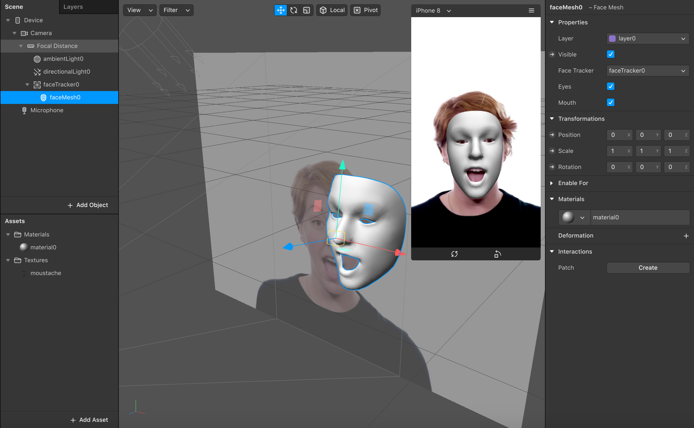
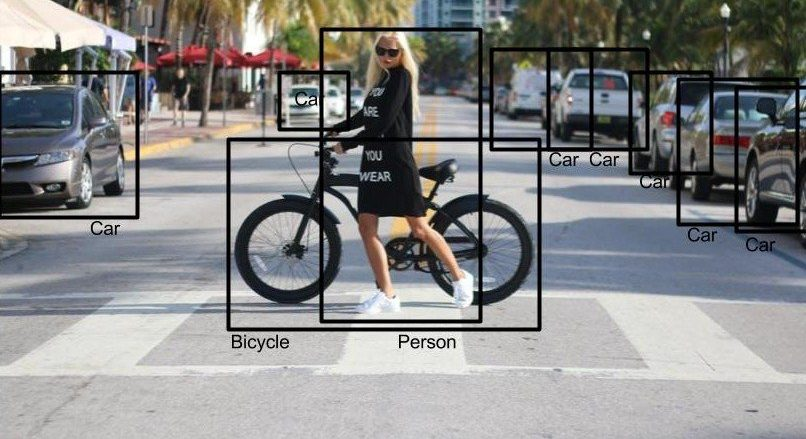
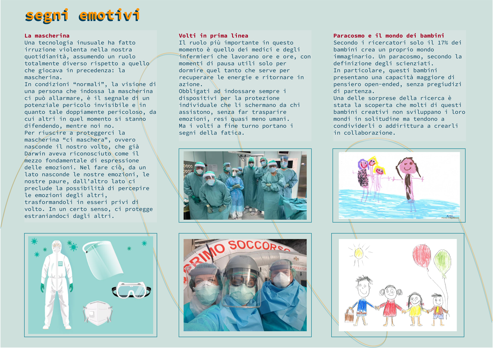
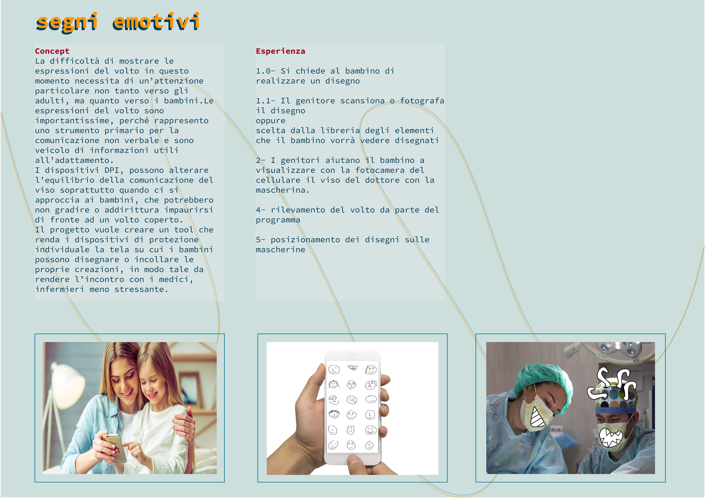
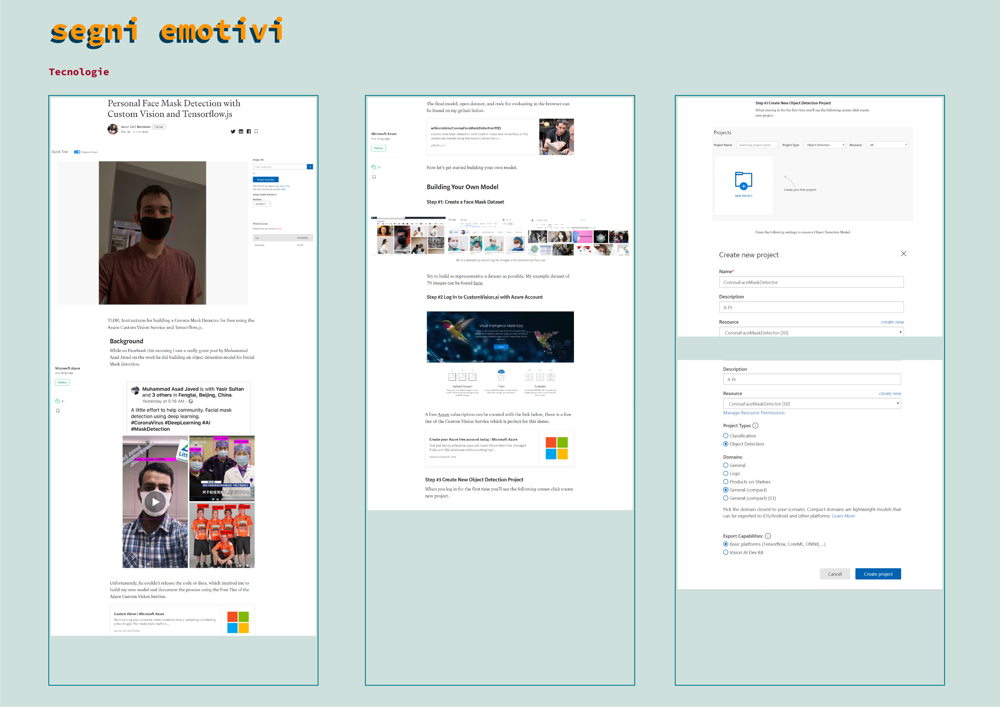
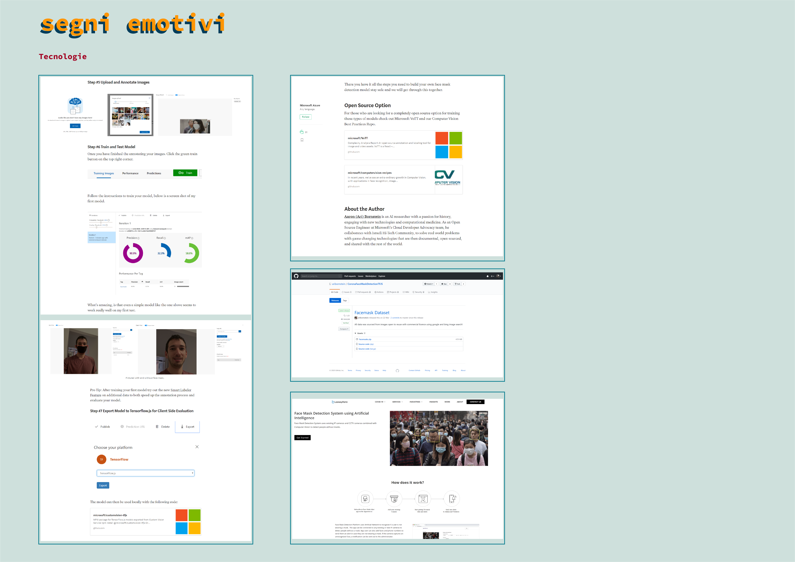
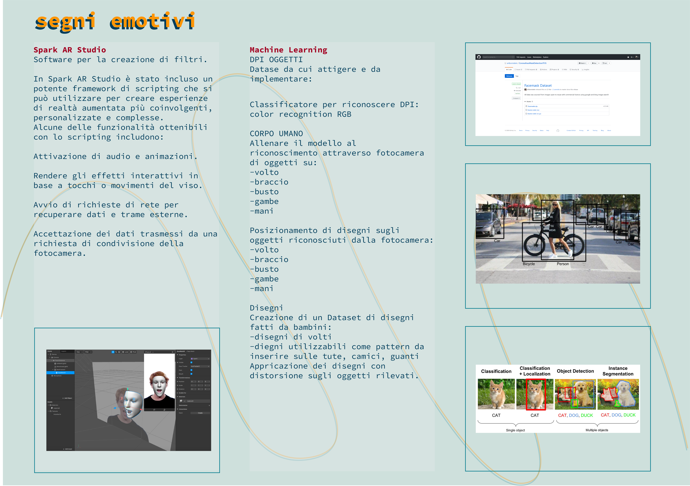

# Segni Emotivi

--------------------------------------------------------------------------------------------------------------------------------------

**La mascherina**  
Una tecnologia inusuale ha fatto irruzione violenta nella nostra quotidianità, assumendo un ruolo totalmente diverso rispetto a quello che giocava in precedenza: la mascherina. In condizioni “normali”, la visione di una persona che indossa la mascherina ci può allarmare, è il segnale di un potenziale pericolo invisibile e in quanto tale doppiamente pericoloso, da cui altri in quel momento si stanno difendendo, mentre noi no. Per riuscire a proteggerci la mascherina “ci maschera”, ovvero nasconde il nostro volto, che già Darwin aveva riconosciuto come il mezzo fondamentale di espressione delle emozioni. Nel fare ciò, da un lato nasconde le nostre emozioni, le nostre paure, dall’altro lato ci preclude la possibilità di percepire le emozioni degli altri, trasformandoli in esseri privi di volto. In un certo senso, ci protegge estraniandoci dagli altri.

-----------------------------------------------------------------------------------------

**Volti in prima linea**  
Il ruolo più importante in questo momento è quello dei medici e degli infermieri che lavorano ore e ore, con momenti di pausa utili solo per dormire quel tanto che serve per recuperare le energie e ritornare in azione. Obbligati ad indossare sempre i dispositivi per la protezione individuale che li schermano da chi assistono, senza far trasparire emozioni, resi quasi meno umani. Ma i volti a fine turno portano i segni della fatica.

-----------------------------------------------------------------------------------------

**Paracosmo e il mondo dei bambini** Secondo i ricercatori solo il 17% dei bambini crea un proprio mondo immaginario. Un paracosmo, secondo la definizione degli scienziati. In particolare, questi bambini presentano una capacità maggiore di pensiero open-ended, senza pregiudizi di partenza. Una delle sorprese della ricerca è stata la scoperta che molti di questi bambini creativi non sviluppano i loro mondi in solitudine ma tendono a condividerli o addirittura a crearli in collaborazione.

------------------------------------------------------------------------------------------------------------------------------------------------------------------------------------

**Concept**  
La difficoltà di mostrare le espressioni del volto in questo momento necessita di un’attenzione particolare non tanto verso gli adulti, ma quanto verso i bambini.Le espressioni del volto sono importantissime, perché rappresento uno strumento primario per la comunicazione non verbale e sono veicolo di informazioni utili all’adattamento. I dispositivi DPI, possono alterare l’equilibrio della comunicazione del viso soprattutto quando ci si approccia ai bambini, che potrebbero non gradire o addirittura impaurirsi di fronte ad un volto coperto. Il progetto vuole creare un'App che renda i dispositivi di protezione individuale la tela su cui i bambini possono disegnare o incollare le proprie creazioni, in modo tale da rendere l’incontro con i medici, infermieri meno stressante.

**Esperienza**  
1.0- Si chiede al bambino di realizzare un disegno 1.1- Il genitore scansiona o fotografa il disegno oppure scelta dalla libreria degli elementi che il bambino vorrà vedere disegnati 2- I genitori aiutano il bambino a visualizzare con la fotocamera del cellulare il viso del dottore con la mascherina. 4- rilevamento del volto da parte del programma 5- posizionamento dei disegni sulle mascherine

**link utili**  
[Personal Face Mask Detection with Custom Vision and Tensorflow.js](https://medium.com/microsoftazure/corona-face-mask-detection-with-custom-vision-and-tensorflow-js-86e5fff84373)  
[Corona Face Mask Detection with Custom Vision and Tensorflow.js](https://github.com/aribornstein/CoronaFaceMaskDetectionTFJS)

------------------------------------------------------------------------------------------------------------------------------------------------------------------------------------

**Tecnologie**  

**Spark AR Studio**  
Software per la creazione di filtri. In [Spark AR Studio](https://sparkar.facebook.com/ar-studio/learn/documentation/scripting/basics) è stato incluso un potente framework di scripting che si può utilizzare per creare esperienze di realtà aumentata più coinvolgenti, personalizzate e complesse. Alcune delle funzionalità ottenibili con lo scripting includono: Attivazione di audio e animazioni.  
Rendere gli effetti interattivi in base a tocchi o movimenti del viso.  
Avvio di richieste di rete per recuperare dati e trame esterne.  
Accettazione dei dati trasmessi da una richiesta di condivisione della fotocamera.

-----------------------------------------------------------------------------------------

**Machine Learning**  
DPI OGGETTI [Dataset](https://github.com/aribornstein/CoronaFaceMaskDetectionTFJS) da cui attigere e da implementare  
Classificatore per riconoscere DPI:  
color recognition RGB utilizzo di [ml5](https://learn.ml5js.org/docs/#/) bianco + gradazione blu, celeste, turchino  

CORPO UMANO  
-[Allenare](https://learn.ml5js.org/docs/#/) il modello al riconoscimento attraverso fotocamera di oggetti su:  
-[volto](https://learn.ml5js.org/docs/#/reference/face-api?id=demo)  
-braccio  
-busto  
-gambe  
-mani  

Posizionamento di disegni sugli [oggetti](https://learn.ml5js.org/docs/#/reference/yolo) DPI riconosciuti dalla fotocamera:  
-mascherine  
-cuffie  
-camice  
-tuta protettiva  
-schermi facciali  
-guanti  

Disegni  
Creazione di un Dataset di disegni fatti da bambini:  
-disegni di volti  
-diegni utilizzabili come pattern da inserire sulle tute, camici, guanti  
Appricazione dei disegni con distorsione sugli oggetti rilevati.

 

------------------------------------------------------------------------------------------------------------------------------------------------------------------------------------

    
